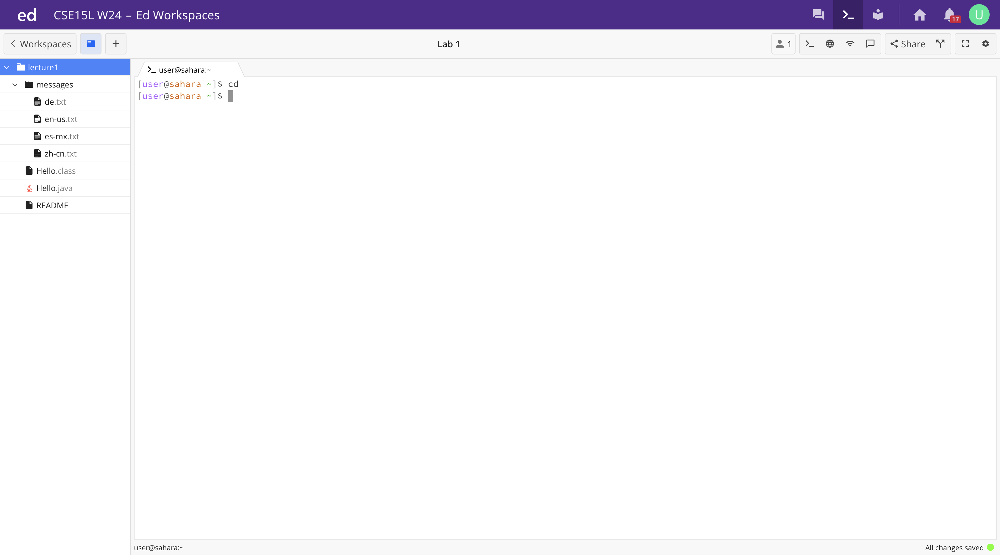
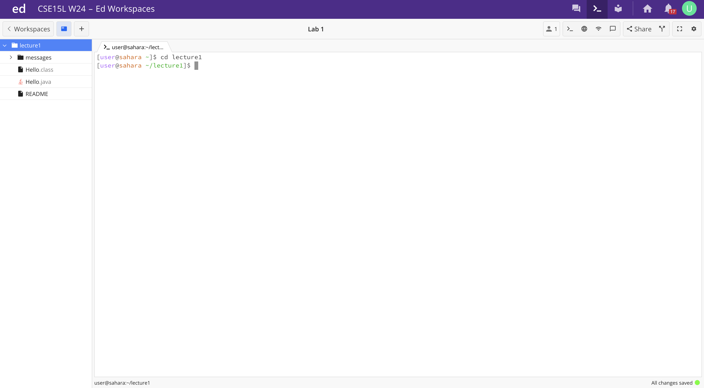
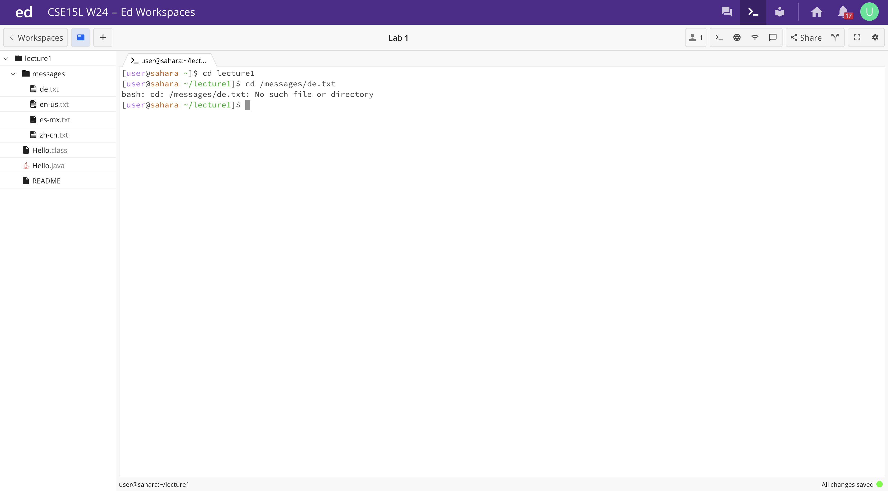
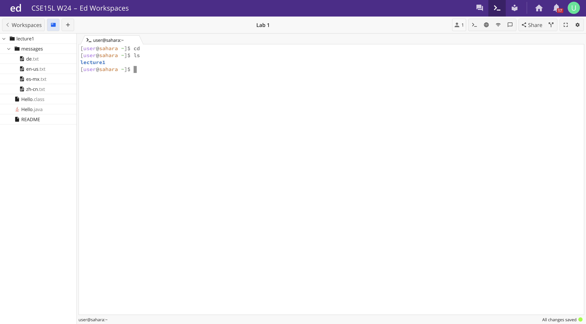
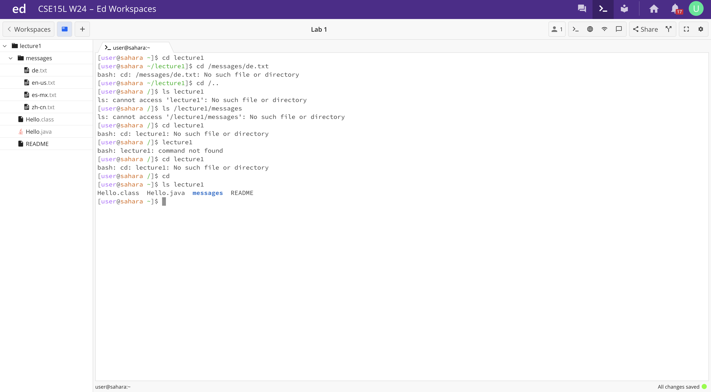
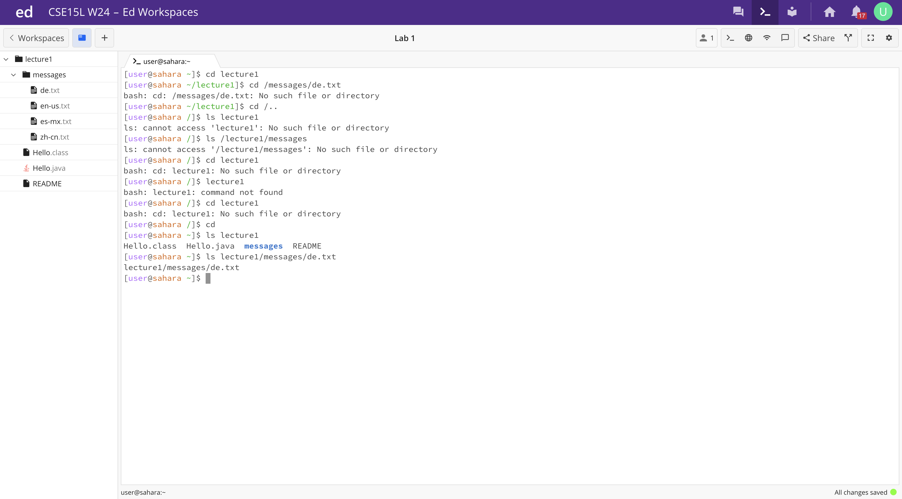
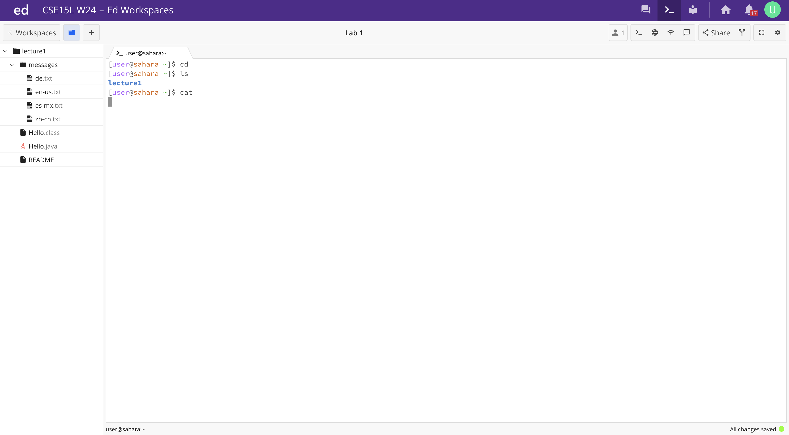
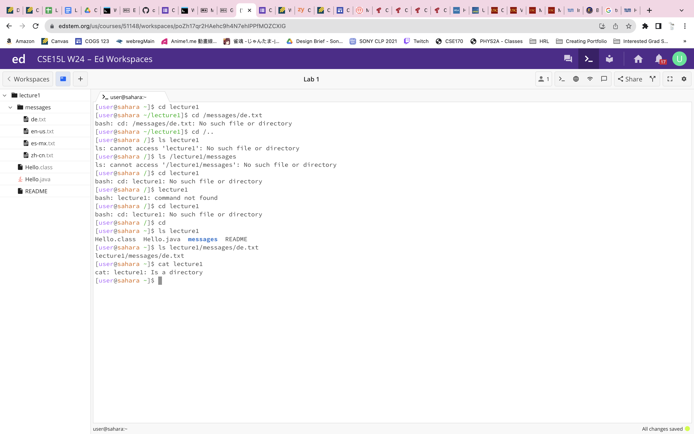
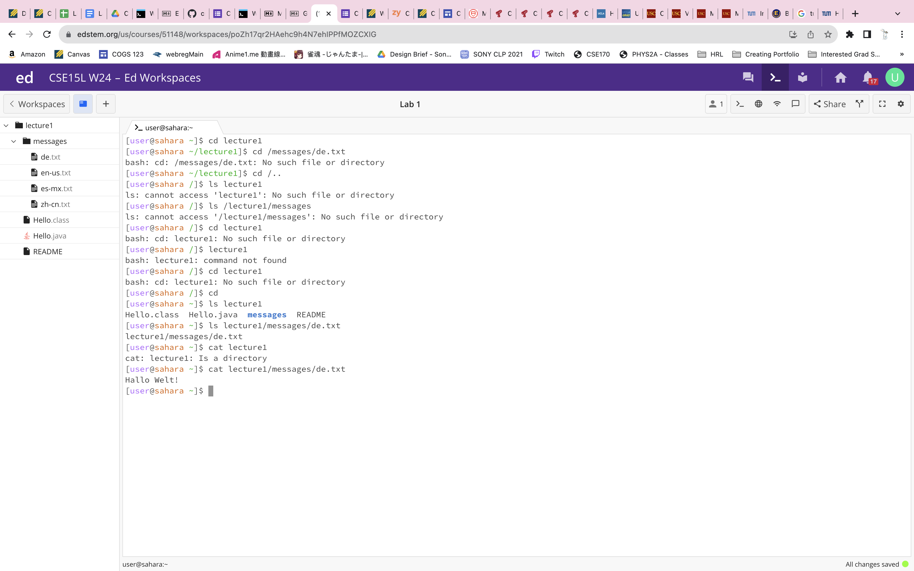

# Lab Report 1 - Remote Access and FileSystem (Week 1)
## Command `cd`
1. Using `cd` ***without*** an argument

The working directory was **`home`** when the command was run. `cd` is used for changing directory. with no argument will return to **`home`** directory. Thus, the output is not an error.

2. Using `cd` with a path to a ***directory***

The working directory was **`home`** when the command was run. `cd` is used for changing directory and **`lecture1`** is a directory. `cd` with a path to a directory will change the directory to **`lecture1`**. Thus, the output is not an error.

3. Using `cd` with a path to a ***file***

The working directory was **`lecture1`** when the command was run. `cd` is used for changing directory and **`messages/de.txt`** is a file in a folder, not a directory. `cd` with a path to a file will cause an error as `cd` is used for changing directory and a file is not a directory. Thus, there is an error in the output.

## Command `ls`
1. Using `ls` ***without*** an argument

The working directory was **`home`** when the command was run. `ls` with no argument will show the file and folder names in the current working directory, which is **`lecture1`** in the **`home`** directory in this case. The output is not an error.

2. Using `ls` with a path to a ***directory***

The working directory was **`home`** when the command was run. `ls` with a path to th directory **`lecture1`** will show the file and folder names - the folder **`messages`** and files **`Hello.class`**, **`Hello.java`**, and **`README`** - in the current working directory **`lecture1`**. The output is not an error.

3. Using `ls` with a path to a ***file***

The working directory was **`home`** when the command was run. `ls` with a path to to a file, which is **`lecture1/messages/de.txt`** will show the path with the file name - **lecture1/messages/de.txt** - in the current working directory **`lecture1/messages`**. The output is not an error.

## Command `cat`
1. Using `cat` ***without*** an argument

The working directory was **`home`** when the command was run. `cat`is used for printing the contents of the files in the given paths. `cat` with no argument means the directory is still in **`home`**. The only thing in home is the folder **`lecture1`**. Thus, it will not print anything. Therefore, the output is not an error.

2. Using `cat` with a path to a ***directory***

The working directory was **`home`** when the command was run. `cat`is used for printing the contents of the files in the given paths and **`lecture1`** is a directory, not files. `cat` with a path to **`lecture1`** will print a statement saying **`lecture1`** is a directory. No contents of the files are printed. Thus, the output is not an error.

3. Using `cat` with a path to a ***file***

The working directory was **`home`** when the command was run. `cat`is used for printing the contents of the files in the given paths and **`lecture1/messages/de.txt`** is a path to file. `cat` with a path to **`lecture1/messages/de.txt`** will print the content inside the file **`de.txt`**, which is ***Hallo Welt!***. Thus, the output is not an error.

