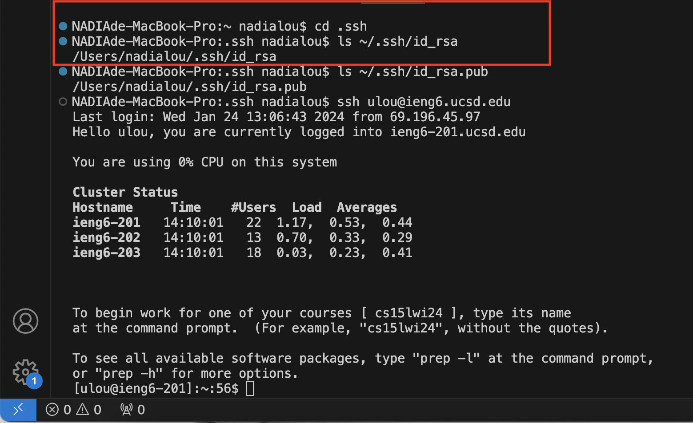

# Lab Report 2 - Servers and SSH Keys (WEEK 3)

## Part 1
```
import java.io.IOException;
import java.net.URI;
import java.util.ArrayList;

class Handler implements URLHandler {
    // The one bit of state on the server: a number that will be manipulated by
    // various requests.
    ArrayList<String> listmessages = new ArrayList<String>();

    public String handleRequest(URI url) {
        String str = null;
        String userparameters = null;
        String text = "";
        if (url.getPath().equals("/")) {
            return String.format("Type /add-message?s=<string>&user=<string> on the URL to add string");
        } 
        else if (url.getPath().equals("/add-message")) {
            String[] parameters = url.getQuery().split("&");
            for (int i = 0; i < parameters.length; i++){
                String[] strparameters = parameters[i].split("=");
                if (strparameters[0].equals("s")) {
                    str = strparameters[1];
                }
                else if (strparameters[0].equals("user")) {
                    userparameters = strparameters[1];
                }
            }
            String message = userparameters + ": " + str + "\n";
            listmessages.add(message);
            for (int i = 0; i < listmessages.size(); i++) {
                String lines = listmessages.get(i);
                text += lines;
            }
            System.out.println(text);

            return text;
        } 
        else {
            return "Invalid Input! Please make sure s and user is filled.";
        }
    }
}

class ChatServer {
    public static void main(String[] args) throws IOException {
        if(args.length == 0){
            System.out.println("Missing port number! Try any number between 1024 to 49151");
            return;
        }

        int port = Integer.parseInt(args[0]);

        Server.start(port, new Handler());
    }
}
```


I called the `handleRequest(URI url)` and `main(String[] args)` method in ChatServer.java and `start(int port, URLHandler handler)` and `handle(final HttpExchange exchange)` in Server.java. Relevant arguments are the `URI url`, `port` and `Handler()`. The relevant arguments for the URI url are `/`, `/add-message`, the String[] args is `port`, the int port is any number between 1024 to 49151 and handler is `final HttpExchange exchange`. The values in ChatServer.java in the photo for int port is `4000`, String str is `Hello`, String userparameters is `ulam`, String message is `ulam: Hello /n`, listmessages is `{"ulam: Hello /n"}`, String[] parameters is `{"s=Hello","user=ulam}`, and String[] strparameters is `{"s","Hello}` and `{"user","ulam"}` respectively while it loops. The values of the class that change from this specific request are port which initially is url which changes from `/` to `/add-message?s=Hello&user=ulam`, str which is `null` to `Hello`, userparameters from ` null` to `ulam`, listmessages which is orginially empty and now `{"ulam: Hello /n"}`, strparameters changes from `{"s","Hello}` to `{"user","ulam"}` when looping.


I called the `handleRequest(URI url)` and `main(String[] args)` method in ChatServer.java and `start(int port, URLHandler handler)` and `handle(final HttpExchange exchange)` in Server.java. Relevant arguments are the `URI url`, `port` and `Handler()`. There is no change from this specific request for `Server.start` method. Yet the listmessage in `handleRequest(URI url)` will add new messages to it.

## Part 2

The absolute path to the private key for your SSH key for logging into ieng6 (on your computer, an EdStem workspace, or on the home directory of the lab computer)

Working Directory when running the command:`.ssh`

command line : `ls ~\.ssh/id_rsa`

***The command lines are inside the red rectangle.***



The absolute path to the public key for your SSH key for logging into ieng6 (this is the one you copied to your account on ieng6, so it should be a path on ieng6's file system)

Working Directory when running the command:`.ssh`

command line : `ls ~\.ssh/id_rsa.pub`

***The command lines are inside the red rectangle.***


This is a photo showing the path of the key in my local machine.


This is the photo showing the path of the public key in `ieng6`

A terminal interaction where you log into your ieng6 account without being asked for a password.

Working Directory when running the command:`.ssh`

command line : `ssh ulou@ieng6-201.ucsd.edu`

The screenshot shows it did not require me to enter my password when I log into my ieng6 account.

***The command lines are inside the red rectangle.***


## Part 3
As someone with a weak fundation in coding, the knowledge about urls, servers, and local machines are all brand new for me. I learnt how to link to a server and build a server that could work in week 2 and week 3. I also learnt hwo to implement different functions/methods such as add and search. I also learn what components make the website link. In addition, I learn what `scp` and `mkdir` is. Last thing I learnt is to set up ssh key for easier access to the server which saves a lot of time.
