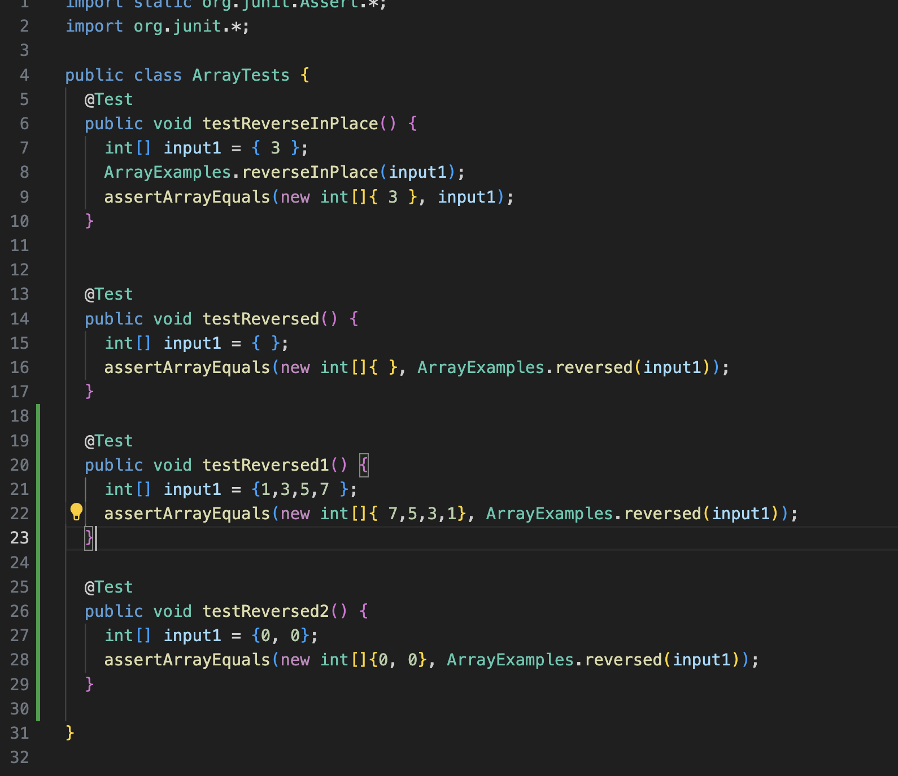
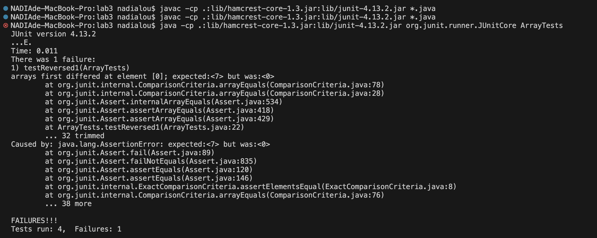

# Lab Report 3 - Bugs and Commands (WEEK 5)

## Part 1 - Bugs
1. A failure-inducing input for the buggy program, as a JUnit test and any associated code

```
   @Test
   public void testReversed1() {
     int[] input1 = {1,3,5,7 };
     assertArrayEquals(new int[]{ 7,5,3,1}, ArrayExamples.reversed(input1));
   }
```

2. An input that doesn't induce a failure, as a JUnit test and any associated code

```
   @Test
   public void testReversed2() {
     int[] input2 = {0,0};
     assertArrayEquals(new int[]{0,0}, ArrayExamples.reversed(input2));
   }
```

3. The symptom, as the output of running the tests (provide it as a screenshot of running JUnit with at least the two inputs above)

JUnit test code:



Output of Running the Tests:



4. The bug, as the before-and-after code change required to fix it (as two code blocks in Markdown)

```
@Before

static int[] reversed(int[] arr) {
  int[] newArray = new int[arr.length];
  for(int i = 0; i < arr.length; i += 1) {
    arr[i] = newArray[arr.length - i - 1];
  }
  return arr;
}

```

```
@After

static int[] reversed(int[] arr) {
  int[] newArray = new int[arr.length];
  for(int i = 0; i < arr.length; i += 1) {
    newArray[i] = arr[arr.length - i - 1];
  }
  return newArray;
}

```

**Why the fix addresses the issue?**

- In the Before code, even though a new integer array newArray is created, the line `arr[i] = newArray[arr.length - i - 1];` in the for loop is updating everything element in the arr with elements in the newArray (which is empty as it is newly created) and return arr which causes all the elements in the arr to be 0. 

- In the After code, I replaced the line `arr[i] = newArray[arr.length - i - 1];` with `newArray[i] = arr[arr.length - i - 1];` and also make it `return newArray;` instead of `return arr;`. Thus, when the for loop runs, all the empty elements inside the newly made newArray will be updated with the elements inside arr in reverse order. Furthremore, as we return to newArray, it will result it a reverse order of the input arr when `reversed(int[] arr)` is called.

## Part 2 - Researching Commands

*I find all the commands through `man grep` on VSCode.*

**1. grep -i**

It finds the files contains the string despite the case as it makes it case insensitive. This is great for saving time in pressing caps locks to finding the exact contents.

```
* NADIAde-MacBook-Pro:docsearch nadialou$ grep -i "APPLE" technical/biomed/*.txt
  technical/biomed/1468-6708-3-10.txt:        questions requiring large sample sizes and to grapple with
  technical/biomed/1471-2105-3-12.txt:            This problem appears to lie in the JAVA applet included
  technical/biomed/1471-2105-3-12.txt:            Moving an Apple-supplied "JAVA Accelerator for PowerPC"
  technical/biomed/1471-2105-3-12.txt:            applet-generated graph may be problematic due to an
  technical/biomed/1471-2105-3-12.txt:            applet incompatibility; capturing the graph as a
  technical/biomed/1471-2121-2-11.txt:          Apple Power Mac 9600.
  technical/biomed/1471-2121-2-18.txt:          camera and an Apple Macintosh computer for capturing
  technical/biomed/1471-2202-2-5.txt:            http://rsb.info.nih.gov/nih-imageand an Apple Macintosh
  technical/biomed/1471-2202-2-5.txt:            computer http://www.apple.com. If the criteria for
  technical/biomed/1471-2458-3-11.txt:        fresh-pressed apple cider [ 28 ] . Other foodborne
  technical/biomed/1472-6793-2-1.txt:            accelerated Power Mac 6100/66 computer (Apple Computer,
  technical/biomed/1472-6793-2-1.txt:            7500/100 (Apple Computer, Cupertino, Ca). The system
  technical/biomed/1472-6882-1-10.txt:          antibiotics and the ananase enzyme (from the pineapple 
  technical/biomed/gb-2002-3-10-research0053.txt:          in pineapple (~70% to 
  technical/biomed/gb-2002-3-12-research0077.txt:          the JAVA applet WebMol [ 35]. In this setting, the color
  technical/biomed/gb-2003-4-8-r51.txt:            visualized using QuickPDB, a Java applet developed by
```

```
* NADIAde-MacBook-Pro:docsearch nadialou$ grep -i "bac" technical/government/Alcohol_Problems/*.txt
  technical/government/Alcohol_Problems/DraftRecom-PDF.txt:After participants had given extensive feedback on specific
  technical/government/Alcohol_Problems/Session2-PDF.txt:alcohol concentration (BAC), coupled with our clinical
  technical/government/Alcohol_Problems/Session2-PDF.txt:course, BAC can help identify acute intoxication. The alcohol
  technical/government/Alcohol_Problems/Session2-PDF.txt:Many injured ED patients are screened with a BAC, which can help
  technical/government/Alcohol_Problems/Session2-PDF.txt:indicate an alcohol problem. While a very high BAC in an unimpaired
  technical/government/Alcohol_Problems/Session2-PDF.txt:patient can be a specific screen for dependence,42 BAC is an
  technical/government/Alcohol_Problems/Session2-PDF.txt:disorder.43 In an ED study, BAC was a poor screen for alcohol abuse
  technical/government/Alcohol_Problems/Session2-PDF.txt:level equivalent to a BAC greater than 0.10 g/dl in an injured
  technical/government/Alcohol_Problems/Session2-PDF.txt:center, BAC had a sensitivity of 63% for an alcohol disorder.5
  technical/government/Alcohol_Problems/Session2-PDF.txt:problematic con-sumption.45-50 Biochemical tests other than BAC may
  technical/government/Alcohol_Problems/Session2-PDF.txt:immediate feedback may help make the transition from screening to
  technical/government/Alcohol_Problems/Session2-PDF.txt:computer feedback, need to be explored.
  technical/government/Alcohol_Problems/Session2-PDF.txt:questions, and checking BAC at the beginning or end of the
  technical/government/Alcohol_Problems/Session2-PDF.txt:all emergency patients with CAGE and then provide feedback. Only
  technical/government/Alcohol_Problems/Session2-PDF.txt:scores; of those, only 41% were provided feedback. Even with
  technical/government/Alcohol_Problems/Session2-PDF.txt:feedback, only 12% accepted follow-up. Of 4,663 patients, only 13
  technical/government/Alcohol_Problems/Session3-PDF.txt:(BAC) determinations under-estimate the extent of alcohol problems
  technical/government/Alcohol_Problems/Session3-PDF.txt:who were injured in vehicular crashes and had a positive BAC were
  technical/government/Alcohol_Problems/Session3-PDF.txt:combination of blood alcohol concentration (BAC), serum gamma
  technical/government/Alcohol_Problems/Session3-PDF.txt:not significantly different. Bachelor's or master's level staff
  technical/government/Alcohol_Problems/Session3-PDF.txt:missed any rebound back to baseline at later time points, and the
  technical/government/Alcohol_Problems/Session3-PDF.txt:Baltimore is using a feedback letter and two or more follow-up
  technical/government/Alcohol_Problems/Session3-PDF.txt:low BAC testing rates for intoxicated drivers by emergency
  technical/government/Alcohol_Problems/Session3-PDF.txt:many clinicians do not routinely obtain a BAC test because of a
  technical/government/Alcohol_Problems/Session3-PDF.txt:◆Personalized Feedback (New)
  technical/government/Alcohol_Problems/Session3-PDF.txt:the subject of problem drinking, providing feedback, and assessing
  technical/government/Alcohol_Problems/Session3-PDF.txt:in the acronym FRAMES: feedback, responsibility, advice, menu of
  technical/government/Alcohol_Problems/Session3-PDF.txt:Brief alcohol interventions have generally included feedback by
  technical/government/Alcohol_Problems/Session3-PDF.txt:provider feedback and advice to the patient have had mixed results
  technical/government/Alcohol_Problems/Session3-PDF.txt:intervention materials and feedback may help to fill gaps in the
  technical/government/Alcohol_Problems/Session3-PDF.txt:to provide targeted, individualized feedback to patients considered
  technical/government/Alcohol_Problems/Session3-PDF.txt:11. Buerhaus PI, Staiger DO, Auerbach DI. Implications of an
  technical/government/Alcohol_Problems/Session3-PDF.txt:their new study with hazardous drinkers who had a positive BAC at
  technical/government/Alcohol_Problems/Session3-PDF.txt:discharge. In his work, they are using a feedback letter and phone
  technical/government/Alcohol_Problems/Session3-PDF.txt:of consent. Patients with BACs of 0.10 and 0.08 g/dl had impaired
  technical/government/Alcohol_Problems/Session3-PDF.txt:estimate their BAC is below 0.08 g/dl.
  technical/government/Alcohol_Problems/Session3-PDF.txt:incorporated into research and more strategies that piggy-back on
  technical/government/Alcohol_Problems/Session4-PDF.txt:subjectively deter-mine if patients were intoxicated (BAC > 0.10
  technical/government/Alcohol_Problems/Session4-PDF.txt:Approaches: Effective Alternatives. Boston: Allyn & Bacon;
  technical/government/Alcohol_Problems/Session4-PDF.txt:limit of a driver's BAC or extending DWI laws to cover snowmobile
  technical/government/Alcohol_Problems/Session4-PDF.txt:Peter Rostenberg agreed that forsaking the BAC prevents good
```

**2. grep -L**

It shows names of files that does not containing selected lines, which is great for data cleaning.

```
* NADIAde-MacBook-Pro:docsearch nadialou$ grep -L "opportunity" technical/government/Alcohol_Problems/*.txt
  technical/government/Alcohol_Problems/Session2-PDF.txt
```

```
* NADIAde-MacBook-Pro:docsearch nadialou$ grep -L "fire" technical/911report/*.txt
  technical/911report/chapter-12.txt
  technical/911report/chapter-8.txt
  technical/911report/preface.txt
```

**3. grep -C num**

It prints lines befor and after each match depending on what I put in num. It is helpful when I want a recap for the files with weird names that contains the word I want without clicking into each of them.

```
* NADIAde-MacBook-Pro:docsearch nadialou$ grep -C 1 "banana" technical/biomed/*.txt 
  technical/biomed/1471-2105-3-6.txt-          the Poet" (14), respectively, "I am a poet. I am very
  technical/biomed/1471-2105-3-6.txt:          fond of bananas." and "I am of very fond bananas. Am I a
  technical/biomed/1471-2105-3-6.txt-          poet?". The procedure includes four steps:
  --
  technical/biomed/1471-2105-3-6.txt-          thunit of the first stanza, "I am a poet. I am very fond
  technical/biomed/1471-2105-3-6.txt:          of bananas.", has USM coordinates 
  technical/biomed/1471-2105-3-6.txt-          USM 
  --
  technical/biomed/1471-2105-3-6.txt-          1bwith solid lining of the segment " 
  technical/biomed/1471-2105-3-6.txt:          bananas ". The matching of the two
  technical/biomed/1471-2105-3-6.txt-          segments of the second stanza (light) to the similar
```

```
* NADIAde-MacBook-Pro:docsearch nadialou$ grep -C 1 "government" technical/government/Alcohol_Problems/*.txt
  technical/government/Alcohol_Problems/DraftRecom-PDF.txt-Longabaugh wondered whether the intended consumers of the
  technical/government/Alcohol_Problems/DraftRecom-PDF.txt:document would include government officials, researchers,
  technical/government/Alcohol_Problems/DraftRecom-PDF.txt-practitioners, and academicians.
  --
  technical/government/Alcohol_Problems/Session3-PDF.txt-been published that deal with alcohol dependence and abuse and
  technical/government/Alcohol_Problems/Session3-PDF.txt:emergency medicine. The challenge now is to discover how government
  technical/government/Alcohol_Problems/Session3-PDF.txt-agencies and professional organizations can promote adoption and
```

**4. grep -n**

It prints line number in the file containing the thing I want to search along with the output line. It could help with locating the documents and specific words quicker when it has a lot of lines.

```
* NADIAde-MacBook-Pro:docsearch nadialou$ grep -n "chocolate" technical/plos/*.txt
  technical/plos/journal.pbio.0020012.txt:8:        designer chocolate with a clear conscience. The demographer sticks to vitamin supplements,
  technical/plos/journal.pbio.0020012.txt:102:        personal anti-ageing regime involves taking “a dose of anti-oxidant chocolate with a good
  technical/plos/journal.pbio.0020213.txt:17:        devastate the lucrative soybean, and rot cacao, threatening the world's supply of chocolate
```

```
* NADIAde-MacBook-Pro:docsearch nadialou$ grep -n "Pentium" technical/biomed/*.txt
  technical/biomed/1471-2105-2-9.txt:426:        (Pentium III, 300 MHz, 300 Mb RAM) running Windows 2000.
  technical/biomed/1471-2105-3-14.txt:702:        ten 1.26 GHz Pentium III processors are being used).
  technical/biomed/1471-2105-3-14.txt:792:          three weeks, performed on eight Pentium III 800 Mhz
  technical/biomed/1471-2105-3-28.txt:728:        (e.g. Pentium Bit Scan Reverse (BSR) instruction [ 6 ] ).
  technical/biomed/1471-2105-3-28.txt:848:          environment http://www.cygwin.com/on a 1 GHz Pentium
  technical/biomed/1471-2202-2-20.txt:699:            Hartland, WI, USA) and analyzed on an IBM Pentium II
  technical/biomed/1472-6807-2-3.txt:523:          MHz Pentium III processor and for a cluster of 64 such
  technical/biomed/1475-925X-2-12.txt:268:          (Comsol, Burlington MA, USA) on a 1.8 GHz Intel Pentium
  technical/biomed/gb-2001-2-7-research0025.txt:899:          MHz Pentium III Xeon processors and 2 GB of RAM on each
  technical/biomed/gb-2002-3-12-research0077.txt:649:          150 sequences of less than 400 amino acids, on a Pentium
  technical/biomed/gb-2002-3-12-research0077.txt:709:          SGI MIPS, Pentium Pro (Windows and Linux) and Macintosh
  technical/biomed/gb-2002-3-12-research0081.txt:388:          standard IA32 architecture nodes, each with dual Pentium
  technical/biomed/gb-2002-3-12-research0081.txt:390:          addition, a single Pentium III-based master node was used
  technical/biomed/rr196.txt:145:          developed in our laboratory. A Pentium computer with a
```
