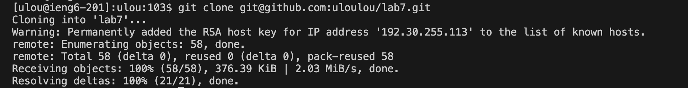

# Lab Report 4 - Vim (Week 7)

1. Log into ieng6

```
Keys Pressed: 
`ssh ulou@ieng6-201.ucsd.edu`<Enter>
`cs15lwi24` <Enter>

Since I opened a new window for lab 4, I typed `ssh ulou@ieng6-201.ucsd.edu`<Enter> to log into my ieng6 and typed `cs15lwi24`<Enter> to log into the course. As I have already saved my SSH key, it automatically log me into the server without asking for password.
```


2. Clone your fork of the repository from your Github account (using the SSH URL)

```
Keys Pressed: 
`git clone` <Space><Ctrl-V><Enter>

To clone my fork, I first copy the SSH url in GitHub, then I typed `git clone` <Space><Ctrl-V><Enter> to get the full command `git clone git@github.com:uloulou/lab7.git` for cloning lab7.
```



3. Run the tests, demonstrating that they fail

```
Keys Pressed:
`ls`<Enter>
`cd lab7` <Enter>
<up><up><Enter>
`bash t`<Tab> --> `bash test.sh`

Before I run the test, since I cloned the file inside ieng6, I need to check what files and directories are in my current directory now. I typed `ls`<Enter> and it shows lab7 and wavelet. As I know the newly cloned repository is lab7, I need to change my directory to `lab7` using `cd lab7` <Enter>. Then,to check what files and directories are in lab7, I used <up><up><Enter> to get `ls` as it is 2 up in the history. I get ListExamples.java, ListExamplesTests.java, lib, and test.sh. Lastly, to run the tests, I type `bash t` then use <Tab> to fill the remaining words `est.sh` and get `bash test.sh` then I presseed <Enter> to run it.
```


4. Edit the code file to fix the failing test

```
Keys Pressed:
`vim L`<Tab>`.java`<Enter> --> `vim ListExample.java`
`44`<Shift>`G`
`i`
<right><right><right><right><right><right>
`delete`
`2`
`esc`
`:wq!`<Enter>

Since from the previous test run, I know the error is in line 44 of ListExample.java and line 19 of ListExampleTesters.java. Thus, I used `vim L`<Tab> to get the autofill for `vim ListExample` and I continued type `.java` to get the full command `vim ListExample.java` to open the file. Then I used `44`<Shift>`G`to jump to the line where the error occurs. I found out the `index1` should be `index2`. So, I pressed `i` to start insert mode. I pressed <right><right><right><right><right><right> 6 right to get to the space in between `index1` and `+=`. Then I pressed `delete` to delete `1` and pressed `2` to insert `2` at where `1` was originally. To close insert mode, I pressed `esc` and I pressed `:wq!`<Enter> to save my edits and exit vim.
```


5. Run the tests, demonstrating that they now succeed

```
Keys Pressed:
<up><up><Enter>

Since from the previous test run, I know the error is in line 44 of ListExample.java and line 19 of ListExampleTesters.java. Now the error in line 44 of ListExample.java is fixed and thus it should run properly for line 19 of ListExampleTesters.java too. To check if it now succeed, I pressed <up><up><Enter> to get `bash test.sh` as it is 2 up in the history.
```


6. Commit and push the resulting change to your Github account (you can pick any commit message!)

```
Keys Pressed:
<up><up><Enter>

Since from the previous test run, I know the error is in line 44 of ListExample.java and line 19 of ListExampleTesters.java. Now the error in line 44 of ListExample.java is fixed and thus it should run properly for line 19 of ListExampleTesters.java too. To check if it now succeed, I pressed <up><up><Enter> to get `bash test.sh` as it is 2 up in the history.
```


