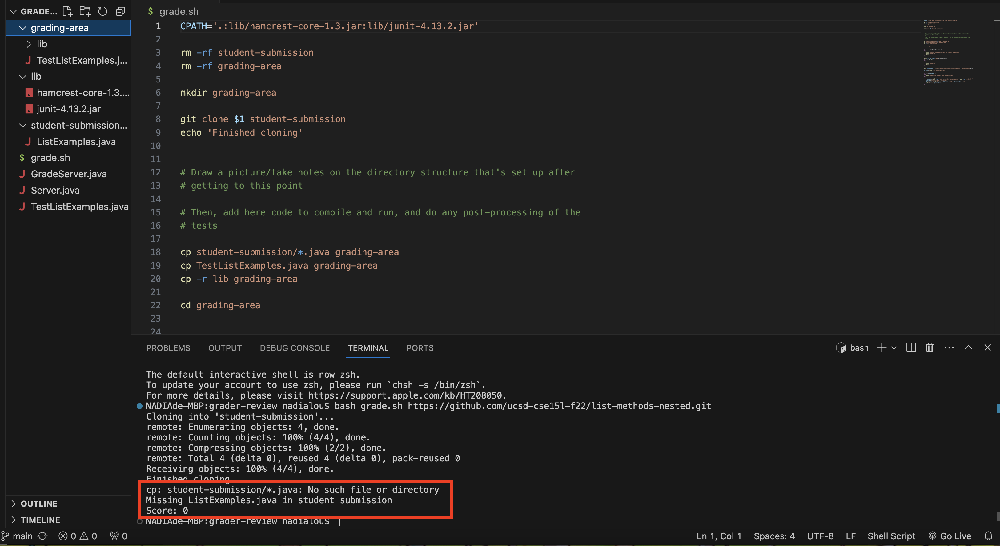
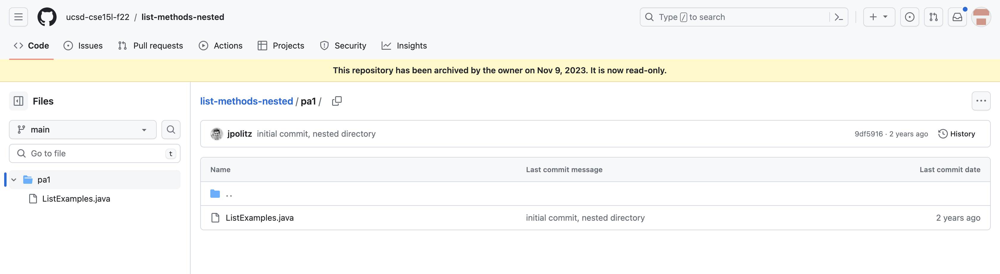
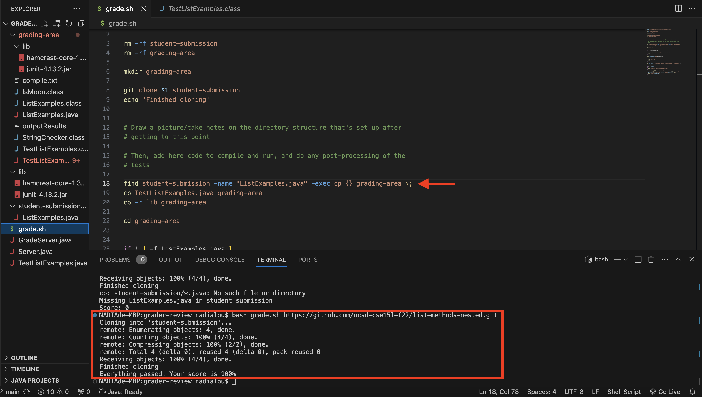

# Lab Report 5 - Putting it All Together (Week 9)

## Part 1 – Debugging Scenario

Student: Hello! I am writing a bash script for grading the `ListExamples.java` in lab 6. But one of the sample submissions never passed and even ended up saying no such file and missing. I checked the code in GitHub for that sample submission and it is the same as other samples. It should have passed the test. I am quite sure my coding for grading cases is right and I do see the file in the `grading-area` and `student-submission` directory. My guess is my file did not go through the code properly despite it being shown on the directories but I am not sure why. This is what the symptoms show on the terminal. Please help me!

TA: Hello! You are on the right direction about your bug and thank you for the screenshot of the symptoms. Seems like you are testing the Sample Submission for implementation saved in a nested directory. Do you remember what does line 18 `cp student-submission/*.java grading-area` in the bash script do? Is it going to go inside the nester directory and copy the code for bash script? If not, think of what commands should you use here. (Hint: what command can recursively traverse the path and list all the files in the directory) 

Student: Thank you for the reply! I changed my line 18 from `cp student-submission/*.java grading-area` to `find student-submission -name "ListExamples.java" -exec cp {} grading-area \;` and now it passes all the test! The bug is really because of my bash script did not recursively traverse the nested directory and obtain all files inside.

## Part 2 – Reflection

In the second half of this quarter, I think `bash` and `vim` is 2 very cool things that I have learn in CSE 15L. The bash scripts makes me understand more how autograder work and vim allows me to view files in terminal easier. `grep` and `find` are two very useful commands I learned. Also when doing my practice skill demo, I am able to understand in what situation `mkdir -p`, `touch`, `rm` and `mv` can be used. `mv` and `rm` is especially useful when I am only using my terminal and type or create the wrong file and would like to rename it or delete it. When doing my skill demo, I also realize despite I learned and able to do most of the commands, I am still a little unfamiliar on how to apply them, especially for the new tasks that appear in the real skill demo test. This encourage me to review my notes and make sure I understand all the concepts such that I can improve my coding skills.