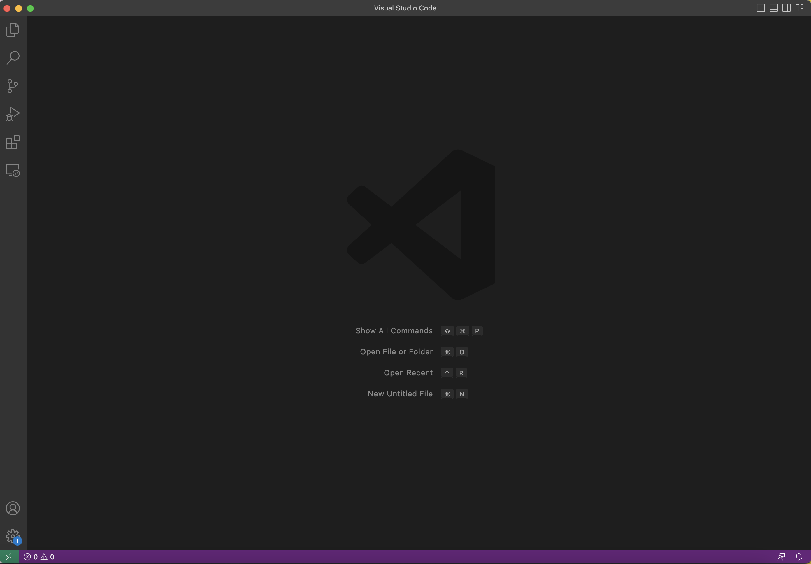
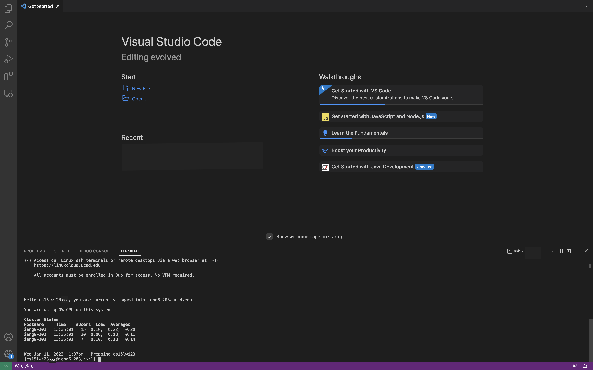

# CSE 15L START-UP TUTORIAL
This is a simple tutorial that helps you to prepare for this course. There are the **three main aspects** (*the bullet points below*) that 15L students need to have and this tutorial will teach you step by step. If you face any difficulty in any steps that the start-up tutorial is not able to answer, feel free to ask tutors or instructors about it.

          1. Visual Studio Code Installation
          2. Remotely Connecting
          3. Test out the Commands

## *IMPORTANT: Setting up your CSE 15L Account

You need to look up the course-specific account for CSE15L at this link: **https://sdacs.ucsd.edu/~icc/index.php**

The tutorial for resetting the password of the account is in this **Doc**: 

***You must read and follow the directions in the tutorial below carefully***

[[TUTORIAL] Resetting Password for CSE15L Account](https://docs.google.com/document/d/17kvwYHXtrP-snWoNsSnPQF5Vu9tyR0WawotVxYEB4do/edit?usp=sharing)

If you’ve successfully reset the pw, wait for a few minutes for it to and you’re waiting a few minutes for the system to respond. 

At this point, you are free to start working on the following sections.

## 1. Visual Studio Code Installation

(If you are using the computers in the lab, you can simply open VS code that is installed inside. You are allowed to work on the lab computers for this course, set-up for personal laptops is not required.)

Visit the Visual Studio Code website https://code.visualstudio.com/, and there will be instructions on how to download and install it on your computer. *Please be mindful that there are versions for all the major operating systems (e.g macOS and Windows)*. So, choose the one that matches your computer.

After Installation, you should be able to open the vs code and see a window like this. (It might have different colors or menu bar based on which system and settings you are using.)

## 2. Remotely Connecting
Many CSE courses use course-specific accounts. It is similar to the account that you might get in future jobs on other systems. This section shows how to use VS code terminal to connect to a remote computer over the Internet to work there.

For **Windows**, you would need to install `git` which has some useful tools that you can use.

[Git for Windows](https://gitforwindows.org/)

After Installation, click on this post to set the default terminal to `git bash` in VS Code:

[Using Bash on Windows in VScode](https://stackoverflow.com/a/50527994)

For **Mac**, bash should be the default shell. If not, open the terminal, then goes to settings. In the General section, you should be able to change your shell.

Next, open a terminal in VScode to use `ssh`. (You can use Ctrl + ` or use the Terminal on the menu then click on New Terminal.) Then, you will be able to input your command with the **xxx** replaced by the letters shown in your course-specific account.

`$ ssh cs15lwi23xxx@ieng6.ucsd.edu`

**Note**: it is *cs one five lowercase L*. Also, you do not need to type in `$` when you are using the terminal. It is a convention for how commands are written.

Since this is most probably the first time you have connected to this server, a message will show up saying the authenticity of host cannot be established and stating the RSA key fingerprint. Then it will ask you:

`Are you sure you want to continue connecting (yes/no/[fingerprint])? `

Type `yes` and press enter. Then it will ask you for your password. 

`Are you sure you want to continue connecting (yes/no/[fingerprint])? 
Password:` 

**It is normal that you do not see anything shown or changed when typing in the pw.** After you logged it, it will be something like this:

Now your terminal is connected to a computer in the CSE basement and the commands you run will also be on that computer.

## 3. Test out the Commands

Since your computer is connected to the server, try to run some commands a few times to see how it works after using ssh.

Some useful commands to test:

* `cd`
* `cd ~`
* `ls -a`
* `ls -lat`
* `ls <directory>` <directory> can be /home/linux/ieng6/cs15lwi23/cs15lwi23xxx, and substitute xxx with other group members' username.

and other commands that you would like to try.
